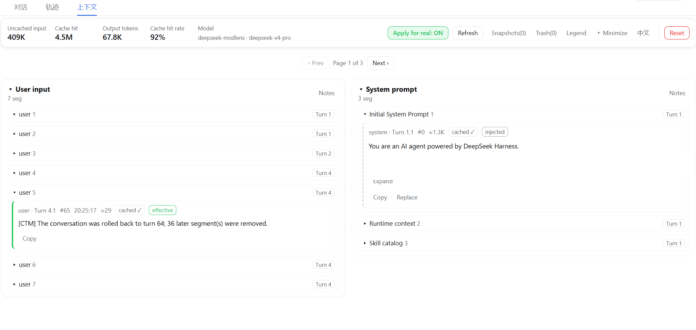

# dsh-ctm — Context Transparency Manager

English | [中文](README-zh.md)

Turns the model's context into a visible, editable, effectiveness-scored first-class object, published as a self-contained bundle plugin for [DeepSeek Harness](https://github.com/deepseek-ai/deepseek-harness).



## Features

- **Full visibility**: a turn → segment flow view colored by role / tokens / cache status / effectiveness, with markdown rendering and paging.
- **Token accounting (provider-measured)**: the KPI strip uses MECE buckets — uncached input / cache hit / output (cache write appears separately only when > 0) — plus a derived cache hit rate (hit ÷ bucket sum; hidden when the denominator is 0) and the model. All figures are whole-session cumulative, read preferentially from the `tokenUsage` session projection, falling back to a full-log event fold when the projection is unavailable (the summary's `usageSource` marks which path was taken). Turn headers show the sum of that turn's step requests; step headers show that single request's measured usage (tooltips state the exact semantics); the latest request's prompt size and context-window occupancy (when the `contextPressure` projection is readable) sit in the KPI tooltip. Segment-level token counts remain local heuristic estimates and are explicitly labeled as estimates.
- **Live refresh**: event-driven (reactive `useSession` subscription) — new messages, tool results and turn boundaries update immediately; no polling.
- **System prompt**: Session V3 compatible. CTM treats the newest `system/message` on the current surface as the editable effective system prompt and displays it under the stable segment-0 identity; migrated historical sessions use the same path.
- **Editable**: replace, delete, rollback, snapshot restore, undo, effectiveness override (manual), and copy segment content (to re-send a rolled-back message, copy the original into the host input box — the host chat UI does not expose its input box to plugins). The initial system prompt is replaceable; all other system-injected content (runtime context etc.), tool results, and CTM placeholder markers are read-only in the UI.
- **Effectiveness engine**: automatic `effective` / `redundant` / `stale` / `injected` verdicts with manual override. The 2-gram similarity sets are LRU-cached (500-entry cap), never rebuilt from scratch per request.
- **Apply for real (off by default)**: when enabled, replace / delete / rollback no longer intercept requests — they are written into the session log as surface `replace` events at `agent/pre-step` (same timing, same mechanism as official compaction), honoring DSH's *model-visible ⟺ logged* invariant: replay / fork / token accounting always match what the model actually saw. Edits are badged "pending" until logged. Deletes and rollbacks are carried by placeholder `user/message` nodes (grouped under "User input" in the UI, read-only protected — not classified as system injections); assistant revisions are carried as user messages by role demotion; tool-call/result pairs are never split (deletion always shadows a *minimal balanced range*: deleting a tool result absorbs the assistant message carrying its tool-call, so the model never sees a dangling call). Undo = a queued (not yet logged) edit is simply dequeued; an already-logged edit is reversed by a counter-replace with the original content (only the most recent operation is undoable); undoing a rollback or a multi-node delete uses a *restore group*: the placeholder node is replaced by the first shadowed item and the rest append to the tail in original order, all demoted to user messages (an append-only log cannot re-add assistant/tool roles), and a restore group is itself undoable (undoing it re-shadows the run). Logging failures are recorded and surfaced at the top of the view. Mutations carrying `expectedVersion` are checked optimistically — a version mismatch rejects the request with zero side effects.
- **System prompt editing**: a replacement of segment 0 is stored as an override and swapped into the section list by the `system-prompt/assemble` waterfall at the next prompt assembly; the agent loop logs the valid `system/message` replacement.
- **i18n**: Chinese / English UI.
- **Zero coupling**: host↔client runs over plain HTTP `POST /ctm` — no Typert `@Remote` / `dsh-api-remotes`; zero runtime dependencies (the tool-pair balance check is re-implemented locally instead of depending on `@deepseek-ai/dsh-compaction`).

## Architecture

```
src/
├── contract.ts       # shared contract: TS types + Zod runtime validation (single source of truth)
├── host.ts           # host half: POST /ctm route + the agent/pre-step & system-prompt/assemble waterfalls
├── usage.ts          # MECE bucket conversion / summation / full-log fold for usage (pure logic, unit-tested)
├── surface-edits.ts  # edit logging layer: replace-event construction, tool-pair balancing, edit-queue application (pure logic, unit-tested)
├── bigrams.ts        # 2-gram sets + LRU cache for the effectiveness engine (pure logic, unit-tested)
└── client/           # browser half: conversation.view tab + fetch('/ctm')
```

- **`contract.ts`**: the host validates requests with it, the client validates responses with it. Types are inferred from Zod schemas, and runtime validation provides cross-version tolerance — the key to a community plugin shipping on its own cadence. New fields are always `.optional()` (e.g. segment `pending`, `usage`; state `applyError`); the single exception was the summary usage rework (old `inputTokens/cachedTokens/...` → MECE `total/lastRequest/usageSource`) — host and client ship in one package, so that one breaking change was made directly.
- **`host.ts`**: registers `POST /ctm` via `webServer`; injects `sessionQuery` / `sessions` / `tokenMeter`. Reads Session V3 surface events from `readSurface`, marks the newest `system/message` as the stable system-prompt segment 0, reads full logs through `snapshotEvents()`, and resolves individual events through `eventAt()`. Usage has two channels: assistant segments carry the provider-measured usage of a single request from the `assistant/message` event; session-level totals prefer `sessionProjections.snapshot()` (an optional service captured through an `ctx.inject` child context — cordis throws on any read of a service not declared in `inject`, optional chaining does not help) for the `tokenUsage` / `contextPressure` projections — the projection folds the complete log, immune to compaction/shadowing — falling back to summing the full log event by event (correct but O(log) per read), with the summary's `usageSource` marking the channel actually used. With *apply for real* on, edits enter a per-session queue and are appended group by group in the `agent/pre-step` waterfall (the turn is open and the request not yet built, so edits take effect in that very request; edits to an idle session queue up and land on the next step). The system-prompt override swaps the whole section list in the `system-prompt/assemble` waterfall. Memory is bounded: session store LRU capped at 50, 20 snapshots per session, 50 trash entries per session.
- **`client/`**: registers a "Context" tab in `conversation.view`; every operation round-trips through `fetch('/ctm')` with responses validated by `ctmResponseSchema`; refresh is triggered reactively via `useSession`. A "pending" badge distinguishes queued-but-unlogged edits from applied ones.

## Wire protocol

`POST /ctm`; the body is an `op`-discriminated union (JSON), and every request carries a `sessionId`:

| op | extra fields |
|----|--------------|
| `getState` | — |
| `replace` | `segmentId`, `content` (UI allows replacing only the initial system prompt and non-system-injected segments; queued for logging when *apply for real* is on) |
| `delete` | `segmentId` |
| `rollback` | `turnIndex` |
| `restore` | `snapshotId` |
| `reset` | — |
| `undo` | — |
| `override` | `segmentId`, `value` (string \| null) |
| `setRealtime` | `enabled` |

Response: `{ ok: true, state: CtmState } | { ok: false, error: string }`.

Every op may additionally carry an optional `expectedVersion` (the `version` of the last state the client applied): the host compares it before any side effect and rejects mismatches with a `stale_version` error notice (optimistic concurrency against multi-client / stale-page races).

**Known limitation**: undoing a rollback or a delete involving tool pairs restores the removed content as user messages (the first item replaces the placeholder node, the rest append to the tail) — an append-only log cannot re-add assistant/tool roles. This is the same role-demotion scheme as assistant edits.


The bundled client does not currently send `expectedVersion`; the host check is available to callers that supply it, not a guarantee for every UI edit. The transcript view belongs to the host and may still show shadowed messages. Compatibility with a newer DeepSeek Harness revision should be checked against the host APIs used by this plugin.

## Install / uninstall

```sh
# Install from GitHub (pinning a tag is safer; on first install pnpm will ask you
# to add the package to allowBuilds in the profile's pnpm-workspace.yaml — git
# installs pull source only, and the package's prepare script builds it at install time)
dsh plugin --profile <name> add github:ac0033/dsh-ctm#v1.0.0
dsh plugin --profile <name> remove dsh-ctm
```

`add` automatically writes the package into the profile's `dependencies` + `dsh.profile.bundles` (because it declares `dsh.bundle`) — no manual `cordis.patch.yml` edits; `remove` cleans up the dependency, the bundle layer and node_modules together.

## Local development

```sh
pnpm install
pnpm build            # produces dsh/index.js (host) + dsh/client.js (client)
```

## Publishing

- Run `pnpm build` before publishing (e.g. a `"prepublishOnly": "pnpm build"` script); community users then receive the prebuilt `dsh/index.js` + `dsh/client.js` with zero build steps.
- Zero runtime dependencies: `zod` is inlined into both bundles; `react` resolves from the shell's module table.
- When moving to your own scope, update both `name` in `package.json` and the `name:` row in `cordis.patch.yml`.

## License

[MIT](LICENSE) © YuanLumen
